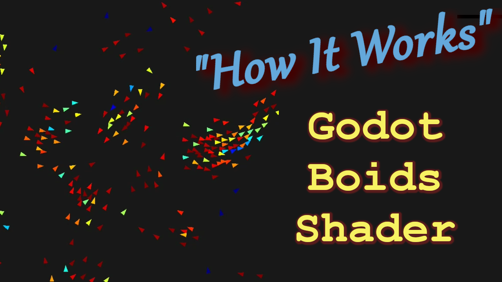

**Boids Flocking Simulation Compute Shader**

Godot Engine v4.4.1.stable

Uses:
- Compute Shader
- Particle Data in Image2D Texture
- Texture2DRD
- MultiMeshInstance2D
- CanvasItem Vertex and Fragment shaders

https://www.youtube.com/@ThePathfindersCodex
